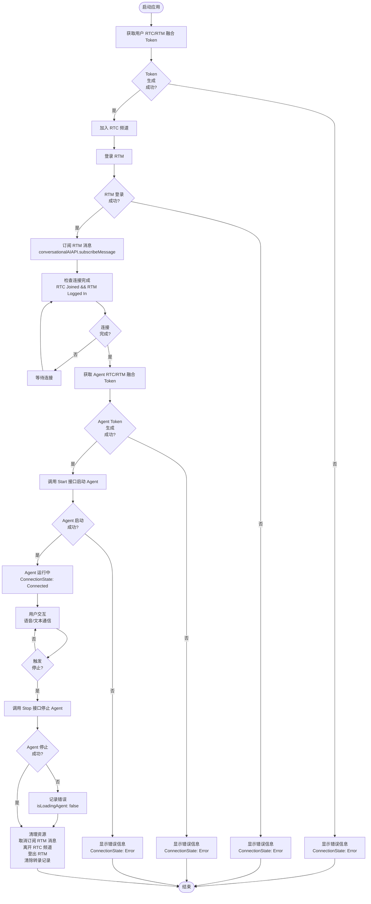
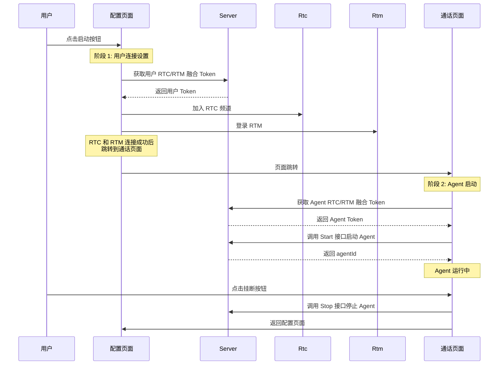

# Agent 自启动流程图

本文档描述了 Agent 自启动的完整流程，包括 Token 生成、RTC/RTM 连接和 Agent 生命周期管理。

## 流程说明

### 阶段 1: 用户连接设置
1. **获取用户 Token**: 使用 `userId` 和空的 `channelName` 为用户生成统一的 RTC/RTM Token
2. **加入 RTC 频道**: 使用生成的 Token 加入 RTC 频道
3. **登录 RTM**: 使用相同的 Token 登录 RTM 服务
4. **订阅消息**: 订阅 RTM 频道消息以接收 Agent 状态和转录内容

### 阶段 2: Agent 启动
1. **获取 Agent Token**: 使用 `agentUid` 和 `channelName` 为 Agent 生成统一的 RTC/RTM Token
2. **启动 Agent**: 使用 Agent 配置（name, pipelineId, channel, agentRtcUid, token）调用启动 Agent 接口
3. **保存 Agent ID**: 存储返回的 `agentId` 供后续使用

### 阶段 3: Agent 运行
- Agent 处于活动状态，准备进行通信
- 用户可以通过语音/文本与 Agent 交互
- 实时显示转录内容
- 监控 Agent 状态变化

### 阶段 4: Agent 停止
1. **停止 Agent**: 使用存储的 `agentId` 调用停止 Agent 接口
2. **清理资源**: 取消订阅 RTM 消息、离开 RTC 频道、登出 RTM 并清除转录记录

## 关键要点

- **Token 生成**: 生成两个独立的 Token - 一个用于用户，一个用于 Agent
- **顺序操作**: RTC 加入和 RTM 登录按顺序进行，但可以并行化
- **错误处理**: 每个步骤都包含错误处理，并更新相应的状态
- **状态管理**: 在整个过程中更新 UI 状态以反映连接状态
- **资源清理**: 停止 Agent 时执行适当的清理操作，防止资源泄漏

---

## 时序图

以下时序图展示了各个组件之间的交互顺序，包括页面跳转的时机。

### 时序图说明

#### 关键步骤
1. **获取用户 Token**: 生成用户 RTC/RTM 融合 Token
2. **加入 RTC 频道**: 使用 Token 加入 RTC 频道
3. **登录 RTM**: 使用 Token 登录 RTM 服务
4. **页面跳转**: RTC 和 RTM 连接成功后，从第一个页面跳转到第二个页面
5. **获取 Agent Token**: 生成 Agent RTC/RTM 融合 Token
6. **启动 Agent**: 调用 Start 接口启动 Agent
7. **停止 Agent**: 调用 Stop 接口停止 Agent

