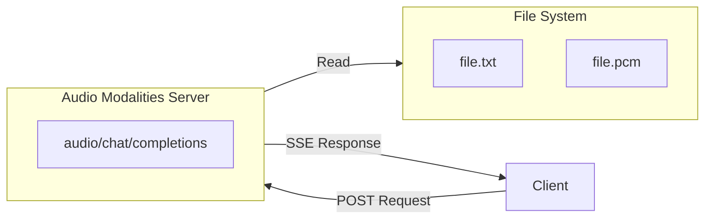
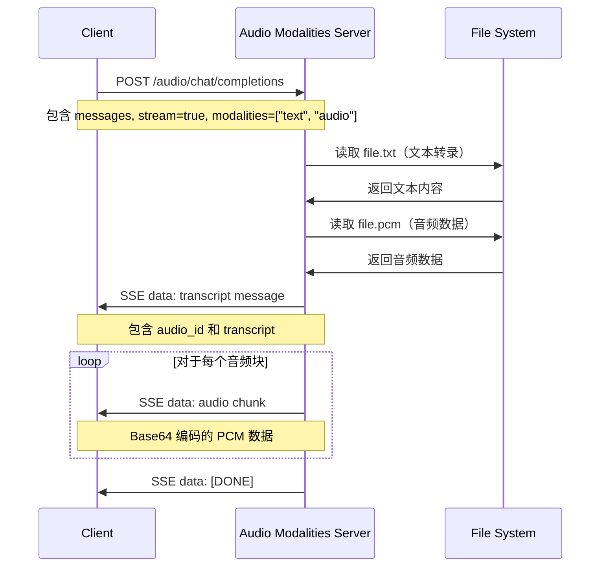

# 🎵 音频模态 LLM Python 示例代码

> Agora 对话式 AI 引擎支持音频模态功能。本项目提供了实现音频模态自定义大语言模型服务的 Python 示例代码。

**项目定位**：本项目主要展示 Audio Modalities 的接口格式和流式传输实现，使用固定的 PCM 文件作为示例数据。在实际应用中，您可以替换为 TTS 服务或其他音频生成方式。

## 📖 什么是音频模态？

音频模态（Audio Modalities）允许 LLM 生成包含音频内容的响应。与纯文本响应不同，音频模态响应包括：

1. **文本转录（Transcript）**：音频对应的文本内容
2. **音频数据块（Audio Chunks）**：Base64 编码的 PCM 音频数据，以流式方式传输

### 为什么使用音频模态？

- ✅ **自然交互**：提供更自然的语音交互体验
- ✅ **实时流式传输**：支持实时音频流式传输，降低延迟
- ✅ **多模态支持**：结合文本和音频，提供更丰富的响应
- ✅ **灵活配置**：支持自定义采样率、数据块大小等参数

## 📁 项目结构

```text
server-audio-modalities/
├── audio_modalities_server.py  # 主服务文件，实现 FastAPI 应用和 /audio/chat/completions 端点
├── audio_modalities.py         # 音频处理模块，提供文件读取和流式响应功能
├── requirements.txt            # Python 依赖包
├── README.md                   # 项目文档
└── .gitignore                  # Git 忽略文件
```

## 🚀 快速开始

### 方式一：本地部署（开发测试）

#### 环境准备

- Python 3.10+

创建虚拟环境：

```bash
python3 -m venv venv
source venv/bin/activate
```

#### 准备测试文件

在项目根目录创建以下测试文件：

**file.txt**（文本转录文件）：
```text
你好，我是 Agora AI 助手。有什么可以帮助您的吗？
```

**file.pcm**（PCM 音频文件）：
- 格式：PCM16（16-bit）
- 采样率：16000 Hz（16kHz）
- 声道：单声道（Mono）

> 💡 **提示**：您可以使用 `ffmpeg` 将其他音频格式转换为 PCM：
> ```bash
> # MP3 转 PCM
> ffmpeg -i input.mp3 -ar 16000 -ac 1 -f s16le file.pcm
> 
> # WAV 转 PCM
> ffmpeg -i input.wav -ar 16000 -ac 1 -f s16le file.pcm
> ```

#### 安装依赖

```bash
pip install -r requirements.txt
```

#### 运行服务

```bash
python3 audio_modalities_server.py
```

服务器运行后，您将看到以下输出：

```bash
INFO:     Uvicorn running on http://0.0.0.0:8000 (Press CTRL+C to quit)
```

#### 测试服务

使用以下命令测试音频模态服务：

```bash
curl -X POST http://localhost:8000/audio/chat/completions \
  -H "Content-Type: application/json" \
  -H "Authorization: Bearer any-api-key" \
  -d '{
    "messages": [
      {"role": "user", "content": "请生成一段音频回复"}
    ],
    "stream": true,
    "modalities": ["text", "audio"]
  }'
```

> 💡 **说明**：`Authorization` header 是必需的（代码会验证），但由于本服务不调用第三方 LLM，可以传任意值（如 `Bearer any-api-key`）。这是为了与 Agora AI Studio 的接口格式保持一致。

**响应格式**：

服务会返回 SSE（Server-Sent Events）格式的流式响应：

1. **文本转录消息**：
```json
data: {"id": "message_id", "choices": [{"index": 0, "delta": {"audio": {"id": "audio_id", "transcript": "你好，我是 Agora AI 助手..."}}, "finish_reason": null}]}
```

2. **音频数据块消息**（多个）：
```json
data: {"id": "message_id", "choices": [{"index": 0, "delta": {"audio": {"id": "audio_id", "data": "base64_encoded_audio_data"}}, "finish_reason": null}]}
```

3. **完成信号**：
```
data: [DONE]
```

### 方式二：GitHub Codespaces 部署（测试 AI Studio 音频模态）

#### 1. 创建 GitHub Codespaces

1. 在 GitHub 上打开您的代码仓库
2. 点击 **Code** 按钮，选择 **Codespaces** 标签
3. 点击 **Create codespace on main** 创建新的 Codespace
4. 等待 Codespace 启动完成

#### 2. 配置端口转发

1. 在 Codespaces 终端中，进入项目目录：
   ```bash
   cd server-audio-modalities
   ```

2. 创建虚拟环境并安装依赖：
   ```bash
   python3 -m venv venv
   source venv/bin/activate
   pip install -r requirements.txt
   ```

3. 准备测试文件（可选，用于测试）：
   ```bash
   # 创建示例文本文件
   echo "你好，我是 Agora AI 助手。" > file.txt
   
   # 注意：需要准备 PCM 音频文件 file.pcm
   # 可以使用 ffmpeg 转换：ffmpeg -i input.mp3 -ar 16000 -ac 1 -f s16le file.pcm
   ```

4. 启动服务：
   ```bash
   python3 audio_modalities_server.py
   ```

5. **配置端口转发**：
   - Codespaces 会自动检测到端口 8000
   - 在 VS Code 的 **Ports** 标签页中，找到端口 8000
   - 右键点击端口，选择 **Port Visibility** → **Public**
   - 复制生成的公共 URL（格式类似：`https://xxxxx-8000.app.github.dev`）

#### 3. 在 AI Studio 中创建项目并配置音频模态 LLM

1. 登录 [Agora Console](https://console.shengwang.cn/)
2. 进入 **AI Studio** → **项目**（或直接访问 [项目页面](https://console-conversationai.shengwang.cn/product/ConversationAI/studio/projects)）
3. 点击 **创建项目**
4. 填写项目信息，打开"自定义设置"配置 llm， 关闭 tts：
```json
{
  "tts":{
   enable:false
  }
  "llm": {
    "vendor": "custom",
    "params": {
      "model": "your-model-name"
    },
    "api_key": "your-api-key-here",
    "url": "https://xxxxx-8000.app.github.dev/audio/chat/completions",
    "output_modalities":["text", "audio"]
  }
}
```

**重要配置说明**：
- `url`：必须包含完整路径 `/audio/chat/completions`
- `api_key`：用于验证请求格式（虽然音频端点不调用 LLM API，但需要提供以保持接口一致性）
- `model`：模型名称（可选，用于标识）

5. 保存项目，**记录生成的 Pipeline ID**（后续启动 Agent 时需要用到）

#### 4. 验证音频模态 LLM

可以使用 `server-python-lite` 脚本验证音频模态 LLM 是否正常工作。详细步骤请参考 [server-python-lite/README.md](../server-python-lite/README.md)。

## 🔄 架构和流程图

### 系统架构



### 请求流程图



## 📖 功能说明

### 音频模态端点

`/audio/chat/completions` 端点实现了音频模态聊天完成功能，支持：

- ✅ **文本转录**：返回音频对应的文本内容
- ✅ **音频流式传输**：以流式方式传输 Base64 编码的 PCM 音频数据
- ✅ **自定义配置**：支持自定义采样率、数据块大小等参数
- ✅ **SSE 格式**：使用 Server-Sent Events 格式进行流式响应

### 响应格式

音频模态响应包含两种类型的消息：

1. **文本转录消息**：
   - `id`：消息 ID
   - `choices[0].delta.audio.id`：音频 ID（用于关联后续音频块）
   - `choices[0].delta.audio.transcript`：文本转录内容

2. **音频数据块消息**：
   - `id`：消息 ID（与文本转录消息相同）
   - `choices[0].delta.audio.id`：音频 ID（与文本转录消息中的 ID 相同）
   - `choices[0].delta.audio.data`：Base64 编码的 PCM 音频数据

### 音频参数配置

在 `audio_modalities.py` 中可以配置以下参数：

```python
sample_rate = 16000  # 采样率（Hz），默认 16kHz
duration_ms = 40     # 每个音频块的时长（毫秒），默认 40ms
```

**计算音频块大小**：
- PCM16（16-bit）：`chunk_size = sample_rate * 2 * (duration_ms / 1000)`
- 示例：16000 * 2 * 0.04 = 1280 字节

## 🔧 实现说明

### 当前实现方式

本项目使用**固定的 PCM 文件**作为示例，主要目的是：
- ✅ **展示 Audio Modalities 接口格式**：演示如何实现 `/audio/chat/completions` 端点
- ✅ **展示流式音频传输**：演示如何以 SSE 格式流式传输音频数据块
- ✅ **展示响应格式**：演示文本转录和音频数据的响应格式

### 实际应用场景

在实际生产环境中，您可以根据需求替换音频生成逻辑：

1. **从数据库读取**：将文本和音频数据存储在数据库中
2. **从对象存储读取**：从 S3、OSS 等对象存储服务读取
3. **实时生成**：使用 TTS（Text-to-Speech）服务实时生成音频
4. **从 LLM 获取**：调用支持音频生成的 LLM API

### 错误处理

服务包含完善的错误处理：

- ✅ 文件不存在时返回 404 错误
- ✅ 文件读取错误时返回 500 错误
- ✅ 流式传输中断时正确处理取消请求
- ✅ 详细的日志记录便于调试

## 🧪 使用 server-python-lite 测试

完成音频模态服务部署和 AI Studio 配置后，可以使用 `server-python-lite` 脚本测试 Agent 是否正常工作。

更多详细信息，请参考 [server-python-lite/README.md](../server-python-lite/README.md)。

## 📚 资源

- 📖 查看我们的 [对话式 AI 引擎文档](https://doc.agora.io/doc/convoai/restful/landing-page) 了解更多详情
- 🧩 访问 [Agora SDK 示例](https://github.com/AgoraIO) 获取更多教程和示例代码
- 👥 在 [Agora 开发者社区](https://github.com/AgoraIO-Community) 探索由开发者社区管理的高质量仓库
- 💬 如有任何问题，欢迎在 [Stack Overflow](https://stackoverflow.com/questions/tagged/agora.io) 上提问

## 💡 反馈

- 🤖 如果您对示例项目有任何问题或建议，欢迎提交 issue。

## 📜 许可证

本项目采用 MIT 许可证。

