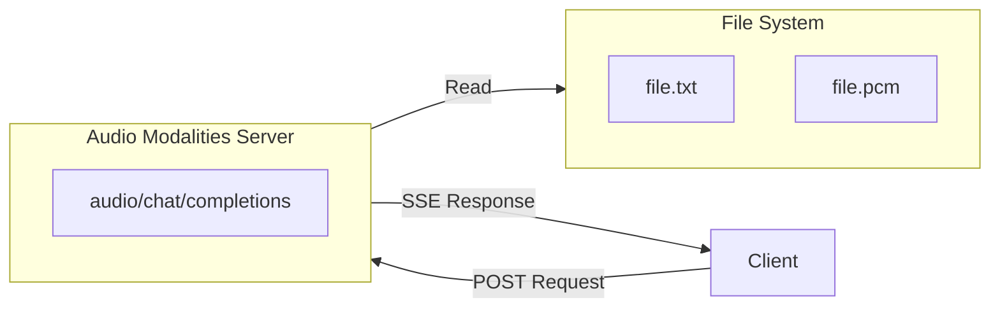
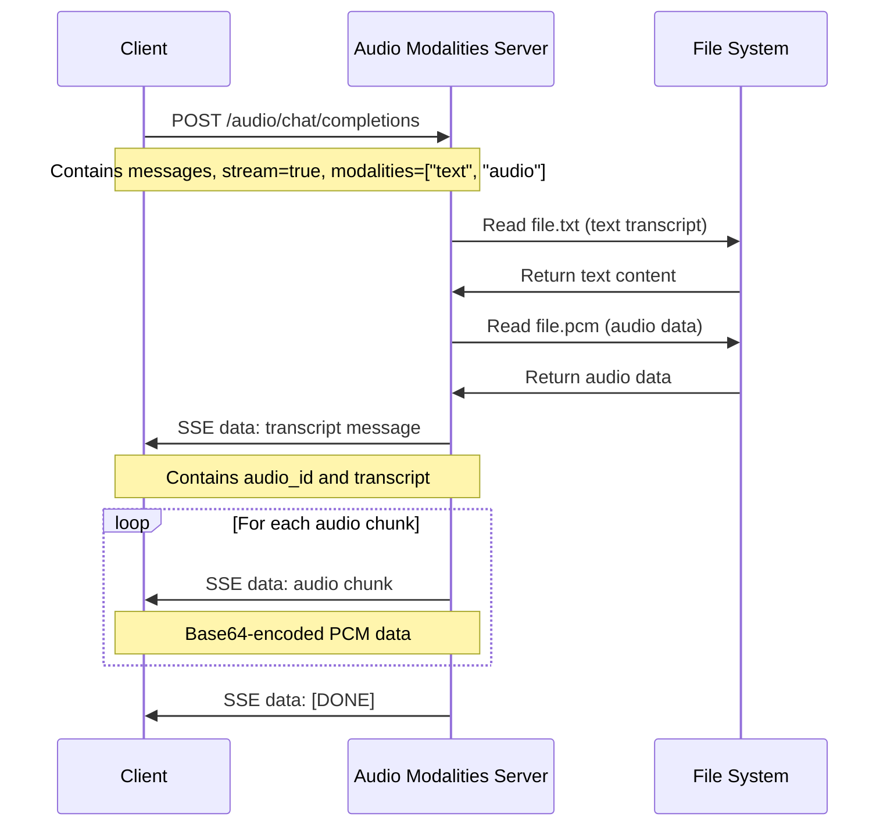

# 🎵 Audio Modalities LLM Python Example Code

[中文](README-CN.md) | English

> Agora Conversational AI Engine supports audio modalities functionality. This project provides Python example code for implementing audio modalities custom Large Language Model services.

**Project Purpose**: This project primarily demonstrates the Audio Modalities interface format and streaming implementation, using fixed PCM files as example data. In actual applications, you can replace this with TTS services or other audio generation methods.

## 📖 What are Audio Modalities?

Audio Modalities allow LLMs to generate responses containing audio content. Unlike pure text responses, audio modality responses include:

1. **Text Transcript**: Text content corresponding to the audio
2. **Audio Chunks**: Base64-encoded PCM audio data transmitted in streaming format

### Why Use Audio Modalities?

- ✅ **Natural Interaction**: Provides a more natural voice interaction experience
- ✅ **Real-time Streaming**: Supports real-time audio streaming, reducing latency
- ✅ **Multimodal Support**: Combines text and audio for richer responses
- ✅ **Flexible Configuration**: Supports custom sample rates, chunk sizes, and other parameters

## 📁 Project Structure

```text
server-audio-modalities/
├── audio_modalities_server.py  # Main service file, implements FastAPI app and /audio/chat/completions endpoint
├── audio_modalities.py         # Audio processing module, provides file reading and streaming response functionality
├── requirements.txt            # Python dependencies
├── README.md                   # Project documentation
└── .gitignore                  # Git ignore file
```

## 🚀 Quick Start

### Method 1: Local Deployment (Development & Testing)

#### Environment Setup

- Python 3.10+

Create virtual environment:

```bash
python3 -m venv venv
source venv/bin/activate
```

#### Prepare Test Files

Create the following test files in the project root directory:

**file.txt** (text transcript file):
```text
Hello, I am Agora AI Assistant. How can I help you?
```

**file.pcm** (PCM audio file):
- Format: PCM16 (16-bit)
- Sample rate: 16000 Hz (16kHz)
- Channels: Mono

> 💡 **Tip**: You can use `ffmpeg` to convert other audio formats to PCM:
> ```bash
> # MP3 to PCM
> ffmpeg -i input.mp3 -ar 16000 -ac 1 -f s16le file.pcm
> 
> # WAV to PCM
> ffmpeg -i input.wav -ar 16000 -ac 1 -f s16le file.pcm
> ```

#### Install Dependencies

```bash
pip install -r requirements.txt
```

#### Run Service

```bash
python3 audio_modalities_server.py
```

After the server runs, you will see the following output:

```bash
INFO:     Uvicorn running on http://0.0.0.0:8000 (Press CTRL+C to quit)
```

#### Test Service

Test the audio modalities service with the following command:

```bash
curl -X POST http://localhost:8000/audio/chat/completions \
  -H "Content-Type: application/json" \
  -H "Authorization: Bearer any-api-key" \
  -d '{
    "messages": [
      {"role": "user", "content": "Please generate an audio response"}
    ],
    "stream": true,
    "modalities": ["text", "audio"]
  }'
```

> 💡 **Note**: The `Authorization` header is required (code validates it), but since this service doesn't call third-party LLMs, you can pass any value (e.g., `Bearer any-api-key`). This is to maintain consistency with Agora AI Studio's interface format.

**Response Format**:

The service returns SSE (Server-Sent Events) formatted streaming responses:

1. **Text Transcript Message**:
```json
data: {"id": "message_id", "choices": [{"index": 0, "delta": {"audio": {"id": "audio_id", "transcript": "Hello, I am Agora AI Assistant..."}}, "finish_reason": null}]}
```

2. **Audio Chunk Messages** (multiple):
```json
data: {"id": "message_id", "choices": [{"index": 0, "delta": {"audio": {"id": "audio_id", "data": "base64_encoded_audio_data"}}, "finish_reason": null}]}
```

3. **Completion Signal**:
```
data: [DONE]
```

### Method 2: GitHub Codespaces Deployment (Testing AI Studio Audio Modalities)

#### 1. Create GitHub Codespaces

1. Open your code repository on GitHub
2. Click the **Code** button, select the **Codespaces** tab
3. Click **Create codespace on main** to create a new Codespace
4. Wait for the Codespace to start

#### 2. Configure Port Forwarding

1. In the Codespaces terminal, navigate to the project directory:
   ```bash
   cd server-audio-modalities
   ```

2. Create virtual environment and install dependencies:
   ```bash
   python3 -m venv venv
   source venv/bin/activate
   pip install -r requirements.txt
   ```

3. Prepare test files (optional, for testing):
   ```bash
   # Create example text file
   echo "Hello, I am Agora AI Assistant." > file.txt
   
   # Note: Need to prepare PCM audio file file.pcm
   # Can use ffmpeg to convert: ffmpeg -i input.mp3 -ar 16000 -ac 1 -f s16le file.pcm
   ```

4. Start the service:
   ```bash
   python3 audio_modalities_server.py
   ```

5. **Configure Port Forwarding**:
   - Codespaces will automatically detect port 8000
   - In VS Code's **Ports** tab, find port 8000
   - Right-click the port, select **Port Visibility** → **Public**
   - Copy the generated public URL (format similar to: `https://xxxxx-8000.app.github.dev`)

#### 3. Create Project in AI Studio and Configure Audio Modalities LLM

1. Log in to [Agora Console](https://console.shengwang.cn/)
2. Go to **AI Studio** → **Projects** (or directly visit [Projects page](https://console-conversationai.shengwang.cn/product/ConversationAI/studio/projects))
3. Click **Create Project**
4. Fill in project information, enable "Custom Settings" to configure llm, disable tts:
```json
{
  "llm": {
    "vendor": "custom",
    "params": {
      "model": "your-model-name"
    },
    "api_key": "your-api-key-here",
    "url": "https://xxxxx-8000.app.github.dev/audio/chat/completions",
    "output_modalities": [
      "audio"
    ]
  }
}
```

**Important Configuration Notes**:
- `url`: Must include the full path `/audio/chat/completions`
- `api_key`: Used to validate request format (although audio endpoint doesn't call LLM API, it needs to be provided to maintain interface consistency)
- `model`: Model name (optional, for identification)

5. Save the project, **record the generated Pipeline ID** (needed when starting Agent later)

#### 4. Verify Audio Modalities LLM

You can use the `server-python-lite` script to verify that Audio Modalities LLM is working properly. For detailed steps, please refer to [server-python-lite/README.md](../server-python-lite/README.md).

## 🔄 Architecture and Flow Diagram

### System Architecture



### Request Flow Diagram



## 📖 Feature Description

### Audio Modalities Endpoint

The `/audio/chat/completions` endpoint implements audio modality chat completion functionality, supporting:

- ✅ **Text Transcript**: Returns text content corresponding to audio
- ✅ **Audio Streaming**: Streams Base64-encoded PCM audio data
- ✅ **Custom Configuration**: Supports custom sample rates, chunk sizes, and other parameters
- ✅ **SSE Format**: Uses Server-Sent Events format for streaming responses

### Response Format

Audio modality responses contain two types of messages:

1. **Text Transcript Message**:
   - `id`: Message ID
   - `choices[0].delta.audio.id`: Audio ID (used to associate subsequent audio chunks)
   - `choices[0].delta.audio.transcript`: Text transcript content

2. **Audio Chunk Message**:
   - `id`: Message ID (same as text transcript message)
   - `choices[0].delta.audio.id`: Audio ID (same as in text transcript message)
   - `choices[0].delta.audio.data`: Base64-encoded PCM audio data

### Audio Parameter Configuration

You can configure the following parameters in `audio_modalities.py`:

```python
sample_rate = 16000  # Sample rate (Hz), default 16kHz
duration_ms = 40     # Duration of each audio chunk (milliseconds), default 40ms
```

**Calculate Audio Chunk Size**:
- PCM16 (16-bit): `chunk_size = sample_rate * 2 * (duration_ms / 1000)`
- Example: 16000 * 2 * 0.04 = 1280 bytes

## 🔧 Implementation Notes

### Current Implementation

This project uses **fixed PCM files** as examples, with the main purpose of:
- ✅ **Demonstrating Audio Modalities Interface Format**: Shows how to implement the `/audio/chat/completions` endpoint
- ✅ **Demonstrating Streaming Audio Transmission**: Shows how to stream audio chunks in SSE format
- ✅ **Demonstrating Response Format**: Shows the response format for text transcripts and audio data

### Real-world Application Scenarios

In actual production environments, you can replace audio generation logic based on requirements:

1. **Read from Database**: Store text and audio data in a database
2. **Read from Object Storage**: Read from S3, OSS, and other object storage services
3. **Real-time Generation**: Use TTS (Text-to-Speech) services to generate audio in real-time
4. **Get from LLM**: Call LLM APIs that support audio generation

### Error Handling

The service includes comprehensive error handling:

- ✅ Returns 404 error when files don't exist
- ✅ Returns 500 error when file reading fails
- ✅ Properly handles cancellation requests when streaming is interrupted
- ✅ Detailed logging for debugging

## 🧪 Testing with server-python-lite

After completing audio modalities service deployment and AI Studio configuration, you can use the `server-python-lite` script to test if the Agent is working properly.

For more detailed information, please refer to [server-python-lite/README.md](../server-python-lite/README.md).

## 📚 Resources

- 📖 Check out our [Conversational AI Engine Documentation](https://doc.agora.io/doc/convoai/restful/landing-page) for more details
- 🧩 Visit [Agora SDK Examples](https://github.com/AgoraIO) for more tutorials and example code
- 👥 Explore high-quality repositories managed by the developer community at [Agora Developer Community](https://github.com/AgoraIO-Community)
- 💬 If you have any questions, feel free to ask on [Stack Overflow](https://stackoverflow.com/questions/tagged/agora.io)

## 💡 Feedback

- 🤖 If you have any questions or suggestions about the example project, please feel free to submit an issue.

## 📜 License

This project uses the MIT License.
