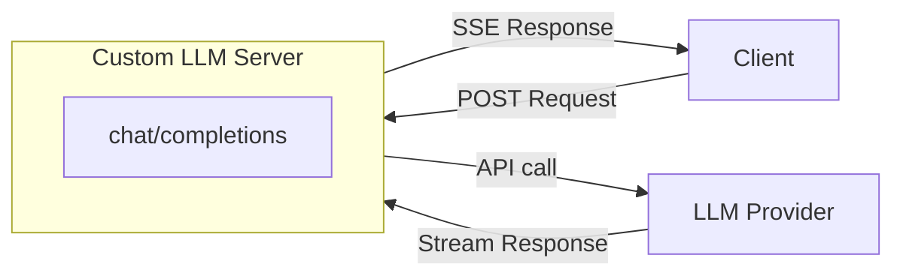
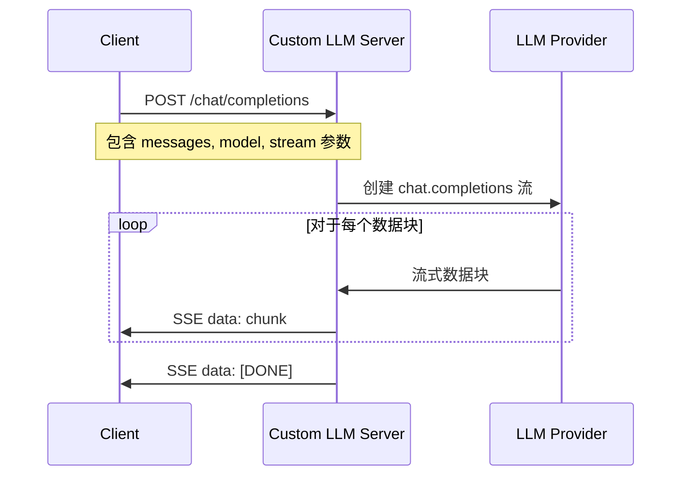

# 🌟 自定义 LLM Python 示例代码

中文 | [English](README.md)

> Agora 对话式 AI 引擎支持自定义大语言模型（LLM）功能。您可以参考本项目代码来实现自定义大语言模型功能。

本文档提供了实现自定义大语言模型功能的 Python 示例代码。

## 🚀 快速开始

### 方式一：本地部署（开发测试）

#### 环境准备

- Python 3.10+

Python 虚拟环境：

```bash
python3 -m venv venv
source venv/bin/activate
```

#### 配置 LLM API 端点（可选）

如果需要使用非 OpenAI 的 LLM 服务，可以修改 `custom_llm.py` 文件中的 `LLM_BASE_URL` 常量：

```python
# 在 custom_llm.py 文件中（第 26 行左右）
LLM_BASE_URL = "https://api.openai.com/v1"  # 修改为您的 LLM 提供商端点
```

**重要提示**：
- 服务器需要兼容 OpenAI Chat Completions API 格式的 LLM 服务
- API Key 必须通过请求的 `Authorization` header 提供（格式：`Bearer <your-api-key>`）
- 默认使用 OpenAI API 端点，如需使用其他服务，请修改代码中的 `LLM_BASE_URL` 常量

#### 安装依赖

```bash
pip install -r requirements.txt
```

#### 运行示例代码

```bash
python3 custom_llm.py
```

服务器运行后，您将看到以下输出：

```bash
INFO:     Uvicorn running on http://0.0.0.0:8000 (Press CTRL+C to quit)
```

使用以下命令测试服务器：

```bash
curl -X POST http://localhost:8000/chat/completions \
  -H "Content-Type: application/json" \
  -H "Authorization: Bearer your-api-key-here" \
  -d '{"messages": [{"role": "user", "content": "Hello, how are you?"}], "stream": true, "model": "your-model-name"}'
```

**注意**：将 `your-api-key-here` 和 `your-model-name` 替换为您的实际 LLM API Key 和模型名称。

### 方式二：GitHub Codespaces 部署（测试 AI Studio 自定义 LLM）

#### 1. 创建 GitHub Codespaces

1. 在 GitHub 上打开您的代码仓库
2. 点击 **Code** 按钮，选择 **Codespaces** 标签
3. 点击 **Create codespace on main** 创建新的 Codespace
4. 等待 Codespace 启动完成

#### 2. 配置端口转发

1. 在 Codespaces 终端中，进入项目目录：
   ```bash
   cd server-custom-llm
   ```

2. 创建虚拟环境并安装依赖：
   ```bash
   python3 -m venv venv
   source venv/bin/activate
   pip install -r requirements.txt
   ```

3. 启动服务：
   ```bash
   python3 custom_llm.py
   ```

4. **配置端口转发**：
   - Codespaces 会自动检测到端口 8000
   - 在 VS Code 的 **Ports** 标签页中，找到端口 8000
   - 右键点击端口，选择 **Port Visibility** → **Public**
   - 复制生成的公共 URL（格式类似：`https://xxxxx-8000.app.github.dev`）

#### 3. 在 AI Studio 中创建项目并配置自定义 LLM

1. 登录 [Agora Console](https://console.shengwang.cn/)
2. 进入 **AI Studio** → **项目**（或直接访问 [项目页面](https://console-conversationai.shengwang.cn/product/ConversationAI/studio/projects)）
3. 点击 **创建项目**
4. 填写项目信息，打开"自定义设置" 配置 llm：
```
{
  "llm": {
    "vendor": "custom",
    "params": {
      "model": "your-model-name"
    },
    "api_key": "your-api-key-here",
    "url": "https://xxxxx-8000.app.github.dev/chat/completions"
  }
}
   ```
5. 保存项目，**记录生成的 Pipeline ID**（后续启动 Agent 时需要用到）

#### 4. 验证 Custom LLM

可以使用 `server-python-lite` 脚本验证 Custom LLM 是否正常工作。详细步骤请参考 [server-python-lite/README.md](../server-python-lite/README.md)。

## 🔄 架构和流程图

### 系统架构



有关请求流程的更多详细信息，请参阅 [请求流程图](#📝-请求流程图) 部分。

## 📖 功能说明

### 支持 LLM 提供商

此服务器支持任何兼容 OpenAI Chat Completions API 格式的 LLM 服务。只需确保您的 LLM 服务提供与 OpenAI API 兼容的接口，并通过 `LLM_BASE_URL` 配置相应的端点即可。

### 自定义大语言模型

> 要成功集成 Agora 对话式 AI 引擎，您的自定义大模型服务必须提供与 OpenAI Chat Completions API 兼容的接口。

`/chat/completions` 端点实现了流式聊天完成功能，支持：
- 文本和图片内容输入
- 工具调用（Tools）支持
- 流式响应（Server-Sent Events）
- 响应格式控制（JSON Schema）

## 📝 请求流程图

### LLM 请求流程



## 🧪 使用 server-python-lite 测试

完成 Custom LLM 服务部署和 AI Studio 配置后，可以使用 `server-python-lite` 脚本测试 Agent 是否正常工作。

更多详细信息，请参考 [server-python-lite/README.md](../server-python-lite/README.md)。

## 📚 资源

- 📖 查看我们的 [对话式 AI 引擎文档](https://doc.agora.io/doc/convoai/restful/landing-page) 了解更多详情
- 🧩 访问 [Agora SDK 示例](https://github.com/AgoraIO) 获取更多教程和示例代码
- 👥 在 [Agora 开发者社区](https://github.com/AgoraIO-Community) 探索由开发者社区管理的高质量仓库
- 💬 如有任何问题，欢迎在 [Stack Overflow](https://stackoverflow.com/questions/tagged/agora.io) 上提问

## 💡 反馈

- 🤖 如果您对示例项目有任何问题或建议，欢迎提交 issue。

## 📜 许可证

本项目采用 MIT 许可证。

