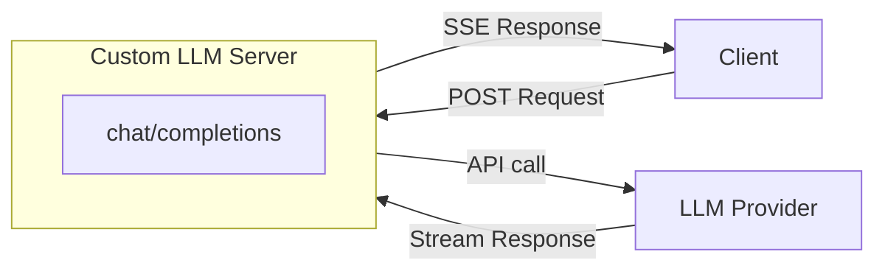
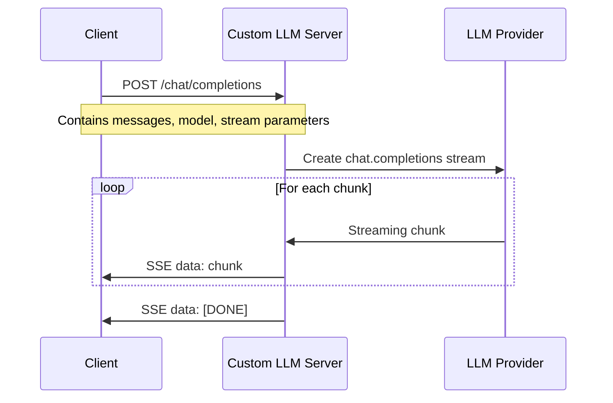

# 🌟 Custom LLM Python Example Code

[中文](README-CN.md) | English

> Agora Conversational AI Engine supports custom Large Language Model (LLM) functionality. You can refer to this project code to implement custom LLM functionality.

This document provides Python example code for implementing custom LLM functionality.

## 🚀 Quick Start

### Method 1: Local Deployment (Development & Testing)

#### Environment Setup

- Python 3.10+

Python virtual environment:

```bash
python3 -m venv venv
source venv/bin/activate
```

#### Configure LLM API Endpoint (Optional)

If you need to use a non-OpenAI LLM service, you can modify the `LLM_BASE_URL` constant in the `custom_llm.py` file:

```python
# In custom_llm.py file (around line 26)
LLM_BASE_URL = "https://api.openai.com/v1"  # Change to your LLM provider endpoint
```

**Important Notes**:

- The server requires an LLM service compatible with OpenAI Chat Completions API format
- API Key must be provided via the `Authorization` header in requests (format: `Bearer <your-api-key>`)
- Default uses OpenAI API endpoint, if you need to use other services, please modify the `LLM_BASE_URL` constant in the code

#### Install Dependencies

```bash
pip install -r requirements.txt
```

#### Run Example Code

```bash
python3 custom_llm.py
```

After the server runs, you will see the following output:

```bash
INFO:     Uvicorn running on http://0.0.0.0:8000 (Press CTRL+C to quit)
```

Test the server with the following command:

```bash
curl -X POST http://localhost:8000/chat/completions \
  -H "Content-Type: application/json" \
  -H "Authorization: Bearer your-api-key-here" \
  -d '{"messages": [{"role": "user", "content": "Hello, how are you?"}], "stream": true, "model": "your-model-name"}'
```

**Note**: Replace `your-api-key-here` and `your-model-name` with your actual LLM API Key and model name.

### Method 2: GitHub Codespaces Deployment (Testing AI Studio Custom LLM)

#### 1. Create GitHub Codespaces

1. Open your code repository on GitHub
2. Click the **Code** button, select the **Codespaces** tab
3. Click **Create codespace on main** to create a new Codespace
4. Wait for the Codespace to start

#### 2. Configure Port Forwarding

1. In the Codespaces terminal, navigate to the project directory:

   ```bash
   cd server-custom-llm
   ```

2. Create virtual environment and install dependencies:

   ```bash
   python3 -m venv venv
   source venv/bin/activate
   pip install -r requirements.txt
   ```

3. Start the service:

   ```bash
   python3 custom_llm.py
   ```

4. **Configure Port Forwarding**:
   - Codespaces will automatically detect port 8000
   - In VS Code's **Ports** tab, find port 8000
   - Right-click the port, select **Port Visibility** → **Public**
   - Copy the generated public URL (format similar to: `https://xxxxx-8000.app.github.dev`)

#### 3. Create Project in AI Studio and Configure Custom LLM

1. Log in to [Agora Console](https://console.shengwang.cn/)
2. Go to **AI Studio** → **Projects** (or directly visit [Projects page](https://console-conversationai.shengwang.cn/product/ConversationAI/studio/projects))
3. Click **Create Project**
4. Fill in project information, enable "Custom Settings" to configure llm:

   ```json
   {
     "llm": {
       "vendor": "custom",
       "params": {
         "model": "your-model-name"
       },
       "api_key": "your-api-key-here",
       "url": "https://xxxxx-8000.app.github.dev/chat/completions"
     }
   }
   ```

5. Save the project, **record the generated Pipeline ID** (needed when starting Agent later)

#### 4. Verify Custom LLM

You can use the `server-python-lite` script to verify that Custom LLM is working properly. For detailed steps, please refer to [server-python-lite/README.md](../server-python-lite/README.md).

## 🔄 Architecture and Flow Diagram

### System Architecture



For more detailed information about the request flow, please refer to the [Request Flow Diagram](#-request-flow-diagram) section.

## 📖 Feature Description

### Supported LLM Providers

This server supports any LLM service compatible with OpenAI Chat Completions API format. Just ensure your LLM service provides an interface compatible with OpenAI API and configure the corresponding endpoint via `LLM_BASE_URL`.

### Custom Large Language Model

> To successfully integrate with Agora Conversational AI Engine, your custom LLM service must provide an interface compatible with OpenAI Chat Completions API.

The `/chat/completions` endpoint implements streaming chat completion functionality, supporting:

- Text and image content input
- Tool calling (Tools) support
- Streaming response (Server-Sent Events)
- Response format control (JSON Schema)

## 📝 Request Flow Diagram

### LLM Request Flow



## 🧪 Testing with server-python-lite

After completing Custom LLM service deployment and AI Studio configuration, you can use the `server-python-lite` script to test if the Agent is working properly.

For more detailed information, please refer to [server-python-lite/README.md](../server-python-lite/README.md).

## 📚 Resources

- 📖 Check out our [Conversational AI Engine Documentation](https://doc.agora.io/doc/convoai/restful/landing-page) for more details
- 🧩 Visit [Agora SDK Examples](https://github.com/AgoraIO) for more tutorials and example code
- 👥 Explore high-quality repositories managed by the developer community at [Agora Developer Community](https://github.com/AgoraIO-Community)
- 💬 If you have any questions, feel free to ask on [Stack Overflow](https://stackoverflow.com/questions/tagged/agora.io)

## 💡 Feedback

- 🤖 If you have any questions or suggestions about the example project, please feel free to submit an issue.

## 📜 License

This project uses the MIT License.
