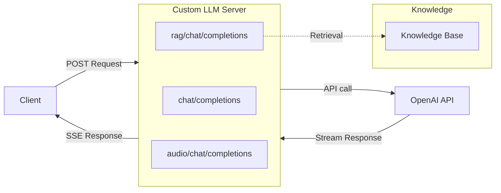
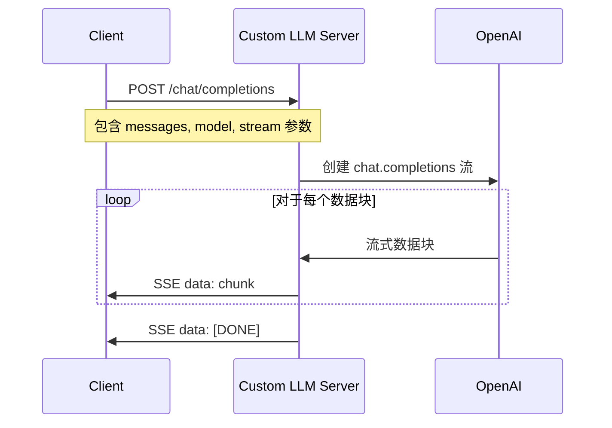
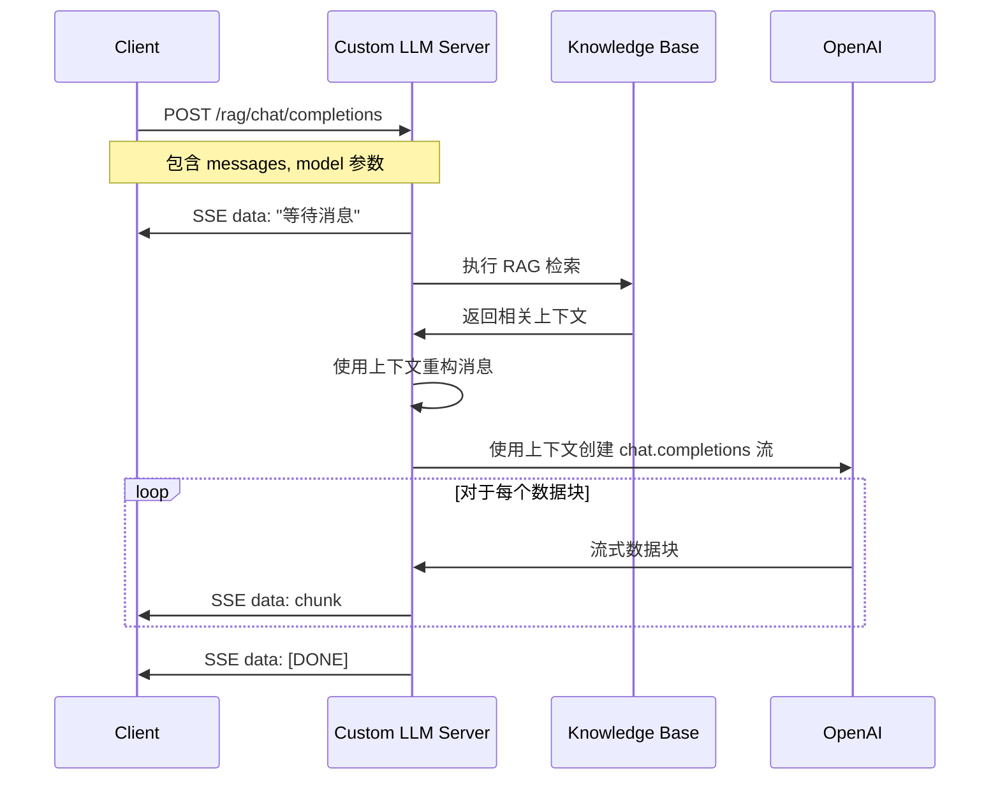
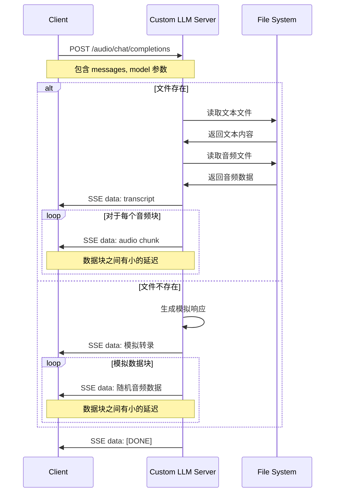

# 🌟 自定义 LLM Python 示例代码

> Agora 对话式 AI 引擎支持自定义大语言模型（LLM）功能。您可以参考本项目代码来实现自定义大语言模型功能。

本文档提供了实现自定义大语言模型功能的 Python 示例代码。

## 🚀 快速开始

### 环境准备

- Python 3.10+

Python 虚拟环境：

```bash
python3 -m venv venv
source venv/bin/activate
```

### 配置环境变量

复制示例环境文件并设置您的 API Key：

```bash
cp .env.example .env
```

编辑 `.env` 文件，配置您的 LLM API：

```bash
# 必需的：LLM 提供商的 API Key
LLM_API_KEY=your-api-key-here

# 可选的：自定义 API 端点（默认为 OpenAI: https://api.openai.com/v1）
# 如果使用其他兼容 OpenAI API 的服务，请设置此变量
LLM_BASE_URL=https://api.openai.com/v1
```

**重要提示**：
- 服务器需要兼容 OpenAI Chat Completions API 格式的 LLM 服务
- 如果使用 OpenAI，只需设置 `LLM_API_KEY`，`LLM_BASE_URL` 使用默认值
- 如果使用其他兼容 OpenAI API 的服务（如 Azure OpenAI、OpenRouter 等），需要同时设置 `LLM_BASE_URL` 指向相应的端点

### 安装依赖

```bash
pip install -r requirements.txt
```

### 运行示例代码

```bash
python3 custom_llm.py
```

服务器运行后，您将看到以下输出：

```bash
INFO:     Uvicorn running on http://0.0.0.0:8000 (Press CTRL+C to quit)
```

使用以下命令测试服务器：

```bash
curl -X POST http://localhost:8000/chat/completions \
  -H "Content-Type: application/json" \
  -H "Authorization: Bearer your-api-key-here" \
  -d '{"messages": [{"role": "user", "content": "Hello, how are you?"}], "stream": true, "model": "gpt-4o-mini"}'
```

**注意**：将 `your-api-key-here` 替换为您的实际 `LLM_API_KEY` 值。

## 🔄 架构和流程图

### 系统架构



有关三个端点及其请求流程的更多详细信息，请参阅 [请求流程图](#📝-请求流程图) 部分。

## 📖 功能说明

### 支持 LLM 提供商

此服务器支持任何兼容 OpenAI Chat Completions API 格式的 LLM 服务。只需确保您的 LLM 服务提供与 OpenAI API 兼容的接口，并通过 `LLM_BASE_URL` 配置相应的端点即可。

### 基础自定义大语言模型

> 要成功集成 Agora 对话式 AI 引擎，您的自定义大模型服务必须提供与 OpenAI Chat Completions API 兼容的接口。

`/chat/completions` 端点实现了基础聊天完成功能。

### 实现检索增强的自定义大语言模型

> 如果您想提高代理响应的准确性和相关性，可以使用检索增强生成（RAG）功能。这允许您的自定义大模型从特定知识库中检索信息，并将检索结果作为上下文提供给大模型以生成答案。

`/rag/chat/completions` 端点演示了使用基于内存的知识存储的简单 RAG 实现。

### 实现多模态自定义大语言模型

> 多模态 LLM 可以处理和生成文本、图像和音频内容。

`/audio/chat/completions` 端点使用转录和音频数据块模拟音频响应。

## 📝 请求流程图

### 基础 LLM 请求流程



### RAG 增强的 LLM 请求流程



### 多模态音频 LLM 请求流程



## 📚 资源

- 📖 查看我们的 [对话式 AI 引擎文档](https://doc.agora.io/doc/convoai/restful/landing-page) 了解更多详情
- 🧩 访问 [Agora SDK 示例](https://github.com/AgoraIO) 获取更多教程和示例代码
- 👥 在 [Agora 开发者社区](https://github.com/AgoraIO-Community) 探索由开发者社区管理的高质量仓库
- 💬 如有任何问题，欢迎在 [Stack Overflow](https://stackoverflow.com/questions/tagged/agora.io) 上提问

## 💡 反馈

- 🤖 如果您对示例项目有任何问题或建议，欢迎提交 issue。

## 📜 许可证

本项目采用 MIT 许可证。
