# 🌟 自定义 LLM Python 示例代码

> Agora 对话式 AI 引擎支持自定义大语言模型（LLM）功能。您可以参考本项目代码来实现自定义大语言模型功能。

本文档提供了实现自定义大语言模型功能的 Python 示例代码。

## 🚀 快速开始

### 环境准备

- Python 3.10+

Python 虚拟环境：

```bash
python3 -m venv venv
source venv/bin/activate
```

### 配置 LLM API 端点（可选）

如果需要使用非 OpenAI 的 LLM 服务，可以修改 `custom_llm.py` 文件中的 `LLM_BASE_URL` 常量：

```python
# 在 custom_llm.py 文件中（第 30 行左右）
LLM_BASE_URL = "https://api.openai.com/v1"  # 修改为您的 LLM 提供商端点
```

**重要提示**：
- 服务器需要兼容 OpenAI Chat Completions API 格式的 LLM 服务
- API Key 必须通过请求的 `Authorization` header 提供（格式：`Bearer <your-api-key>`）
- 默认使用 OpenAI API 端点，如需使用其他服务，请修改代码中的 `LLM_BASE_URL` 常量

### 安装依赖

```bash
pip install -r requirements.txt
```

### 运行示例代码

```bash
python3 custom_llm.py
```

服务器运行后，您将看到以下输出：

```bash
INFO:     Uvicorn running on http://0.0.0.0:8000 (Press CTRL+C to quit)
```

使用以下命令测试服务器：

```bash
curl -X POST http://localhost:8000/chat/completions \
  -H "Content-Type: application/json" \
  -H "Authorization: Bearer your-api-key-here" \
  -d '{"messages": [{"role": "user", "content": "Hello, how are you?"}], "stream": true, "model": "gpt-4o-mini"}'
```

**注意**：
- 将 `your-api-key-here` 替换为您的实际 LLM API Key
- API Key 必须通过 `Authorization` header 传递（格式：`Bearer <your-api-key>`）
- 如需使用其他 LLM 服务，请修改 `custom_llm.py` 中的 `LLM_BASE_URL` 常量

## 🔄 架构和流程图

### 系统架构


有关三个端点及其请求流程的更多详细信息，请参阅 [请求流程图](#📝-请求流程图) 部分。

## 📖 功能说明

### 支持 LLM 提供商

此服务器支持任何兼容 OpenAI Chat Completions API 格式的 LLM 服务。只需确保您的 LLM 服务提供与 OpenAI API 兼容的接口，并通过 `LLM_BASE_URL` 配置相应的端点即可。

### 基础自定义大语言模型

> 要成功集成 Agora 对话式 AI 引擎，您的自定义大模型服务必须提供与 OpenAI Chat Completions API 兼容的接口。

`/chat/completions` 端点实现了基础聊天完成功能。

### 实现检索增强的自定义大语言模型

> 如果您想提高代理响应的准确性和相关性，可以使用检索增强生成（RAG）功能。这允许您的自定义大模型从特定知识库中检索信息，并将检索结果作为上下文提供给大模型以生成答案。

`/rag/chat/completions` 端点演示了使用基于内存的知识存储的简单 RAG 实现。

### 实现多模态自定义大语言模型

> 多模态 LLM 可以处理和生成文本、图像和音频内容。

`/audio/chat/completions` 端点使用转录和音频数据块模拟音频响应。

## 📝 请求流程图

### 基础 LLM 请求流程

```mermaid
sequenceDiagram
    participant Client
    participant Server as Custom LLM Server
    participant OpenAI

    Client->>Server: POST /chat/completions
    Note over Client,Server: 包含 messages, model, stream 参数

    Server->>OpenAI: 创建 chat.completions 流

    loop 对于每个数据块
        OpenAI->>Server: 流式数据块
        Server->>Client: SSE data: chunk
    end

    Server->>Client: SSE data: [DONE]
```



### RAG 增强的 LLM 请求流程

```mermaid
sequenceDiagram
    participant Client
    participant Server as Custom LLM Server
    participant KB as Knowledge Base
    participant OpenAI

    Client->>Server: POST /rag/chat/completions
    Note over Client,Server: 包含 messages, model 参数

    Server->>Client: SSE data: "等待消息"

    Server->>KB: 执行 RAG 检索
    KB->>Server: 返回相关上下文

    Server->>Server: 使用上下文重构消息

    Server->>OpenAI: 使用上下文创建 chat.completions 流

    loop 对于每个数据块
        OpenAI->>Server: 流式数据块
        Server->>Client: SSE data: chunk
    end

    Server->>Client: SSE data: [DONE]
```



### 多模态音频 LLM 请求流程

```mermaid
sequenceDiagram
    participant Client
    participant Server as Custom LLM Server
    participant FS as File System

    Client->>Server: POST /audio/chat/completions
    Note over Client,Server: 包含 messages, model 参数

    alt 文件存在
        Server->>FS: 读取文本文件
        FS->>Server: 返回文本内容

        Server->>FS: 读取音频文件
        FS->>Server: 返回音频数据

        Server->>Client: SSE data: transcript

        loop 对于每个音频块
            Server->>Client: SSE data: audio chunk
            Note over Server,Client: 数据块之间有小的延迟
        end
    else 文件不存在
        Server->>Server: 生成模拟响应
        Server->>Client: SSE data: 模拟转录

        loop 模拟数据块
            Server->>Client: SSE data: 随机音频数据
            Note over Server,Client: 数据块之间有小的延迟
        end
    end

    Server->>Client: SSE data: [DONE]
```



## 📚 资源

- 📖 查看我们的 [对话式 AI 引擎文档](https://doc.agora.io/doc/convoai/restful/landing-page) 了解更多详情
- 🧩 访问 [Agora SDK 示例](https://github.com/AgoraIO) 获取更多教程和示例代码
- 👥 在 [Agora 开发者社区](https://github.com/AgoraIO-Community) 探索由开发者社区管理的高质量仓库
- 💬 如有任何问题，欢迎在 [Stack Overflow](https://stackoverflow.com/questions/tagged/agora.io) 上提问

## 💡 反馈

- 🤖 如果您对示例项目有任何问题或建议，欢迎提交 issue。

## 📜 许可证

本项目采用 MIT 许可证。
