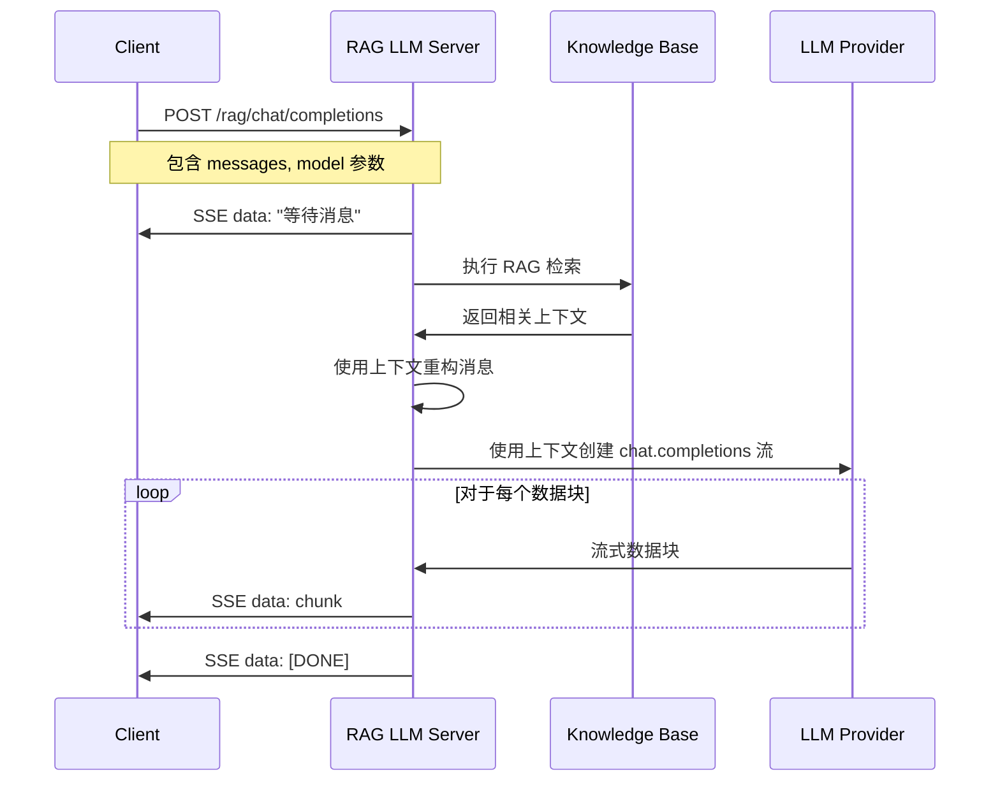

# 🌟 RAG 增强的 LLM Python 示例代码

[中文](README-CN.md) | [English](README.md)

> Agora 对话式 AI 引擎支持检索增强生成（RAG）功能。本项目提供了实现 RAG 增强的自定义大语言模型服务的 Python 示例代码。

## 📖 什么是 RAG？

检索增强生成（Retrieval-Augmented Generation，RAG）是一种结合信息检索和生成式 AI 的技术。它通过以下步骤工作：

1. **检索（Retrieval）**：从知识库中检索与用户查询相关的信息
2. **增强（Augmentation）**：将检索到的信息作为上下文添加到用户查询中
3. **生成（Generation）**：LLM 基于增强后的上下文生成回答

### 为什么使用 RAG？

- ✅ **提高准确性**：基于知识库的真实信息生成回答，减少幻觉
- ✅ **知识更新**：无需重新训练模型，只需更新知识库即可获得最新信息
- ✅ **领域专精**：可以为特定领域定制知识库，提供专业回答
- ✅ **可追溯性**：可以追踪回答的来源，提高可信度

## 📁 项目结构

```text
server-rag/
├── rag_llm.py              # RAG 服务主文件，实现 /rag/chat/completions 端点
├── knowledge_base.py        # 知识库管理模块，提供搜索和管理功能
├── knowledge_base.json      # 知识库数据文件（JSON 格式）
├── requirements.txt        # Python 依赖包
├── README.md               # 项目文档
└── .gitignore             # Git 忽略文件
```

## 🚀 快速开始

### 方式一：本地部署（开发测试）

#### 环境准备

- Python 3.10+

创建虚拟环境：

```bash
python3 -m venv venv
source venv/bin/activate
```

#### 配置 LLM API 端点（可选）

如果需要使用非 OpenAI 的 LLM 服务，可以修改 `rag_llm.py` 文件中的 `LLM_BASE_URL` 常量：

```python
# 在 rag_llm.py 文件中（第 26 行左右）
LLM_BASE_URL = "https://api.openai.com/v1"  # 修改为您的 LLM 提供商端点
```

**重要提示**：
- `LLM_BASE_URL` 是后端 LLM 提供商的 API 端点（如 OpenAI、DeepSeek 等），不是 RAG 服务本身的端点
- 服务器需要兼容 OpenAI Chat Completions API 格式的 LLM 服务
- API Key 必须通过请求的 `Authorization` header 提供（格式：`Bearer <your-api-key>`）
- 默认使用 OpenAI API 端点，如需使用其他服务，请修改代码中的 `LLM_BASE_URL` 常量

#### 配置知识库

编辑 `knowledge_base.json` 文件来添加您的知识库内容：

```json
{
  "category1": [
    "您的知识库内容 1",
    "您的知识库内容 2"
  ],
  "category2": [
    "更多内容..."
  ],
  "default": [
    "这是默认的知识库条目，当没有匹配到其他类别时使用。"
  ]
}
```

**知识库格式说明**：
- 使用 JSON 格式，每个类别是一个数组，包含多个文档字符串
- 类别名称可以是任意字符串（如 "agora"、"ai"、"rag" 等）
- `default` 类别是特殊的，当没有匹配到其他类别时会使用它
- 支持中英文混合内容

**搜索特性**：
- ✅ 支持中英文混合查询和匹配
- ✅ 英文单词使用精确匹配（单词边界），避免误识别
- ✅ 中文使用关键词匹配
- ✅ 自动去除标点符号，提高匹配准确率
- ✅ 按匹配分数排序，返回最相关的文档

**进阶**：可以替换为向量数据库（如 Chroma、Pinecone、Weaviate）或使用嵌入模型进行语义搜索。

#### 安装依赖

```bash
pip install -r requirements.txt
```

#### 运行示例代码

```bash
python3 rag_llm.py
```

服务器运行后，您将看到以下输出：

```bash
INFO:     Uvicorn running on http://0.0.0.0:8000 (Press CTRL+C to quit)
```

使用以下命令测试服务器：

```bash
curl -X POST http://localhost:8000/rag/chat/completions \
  -H "Content-Type: application/json" \
  -H "Authorization: Bearer your-api-key-here" \
  -d '{"messages": [{"role": "user", "content": "什么是 Agora？"}], "stream": true, "model": "your-model-name"}'
```

**注意**：将 `your-api-key-here` 和 `your-model-name` 替换为您的实际 LLM API Key 和模型名称。

#### 验证知识库是否被触发

启动服务后，日志中会显示 RAG 检索的详细信息：

```text
🔍 RAG Retrieval: Searching knowledge base for query: '什么是 Agora？'
📚 RAG Retrieval: Found 3 relevant chunks
🎯 Knowledge Base Match: category='agora', score=2, doc_preview='Agora 提供实时通信解决方案...'
✅ RAG Context Retrieved: 245 characters
📝 RAG Messages Refactored: Added context to 2 messages
```

### 方式二：GitHub Codespaces 部署（测试 AI Studio 自定义 LLM）

#### 1. 创建 GitHub Codespaces

1. 在 GitHub 上打开您的代码仓库
2. 点击 **Code** 按钮，选择 **Codespaces** 标签
3. 点击 **Create codespace on main** 创建新的 Codespace
4. 等待 Codespace 启动完成

#### 2. 配置端口转发

1. 在 Codespaces 终端中，进入项目目录：
   ```bash
   cd server-rag
   ```

2. 创建虚拟环境并安装依赖：
   ```bash
   python3 -m venv venv
   source venv/bin/activate
   pip install -r requirements.txt
   ```

3. 启动服务：
   ```bash
   python3 rag_llm.py
   ```

4. **配置端口转发**：
   - Codespaces 会自动检测到端口 8000
   - 在 VS Code 的 **Ports** 标签页中，找到端口 8000
   - 右键点击端口，选择 **Port Visibility** → **Public**
   - 复制生成的公共 URL（格式类似：`https://xxxxx-8000.app.github.dev`）

#### 3. 在 AI Studio 中创建项目并配置自定义 LLM

1. 登录 [Agora Console](https://console.shengwang.cn/)
2. 进入 **AI Studio** → **项目**（或直接访问 [项目页面](https://console-conversationai.shengwang.cn/product/ConversationAI/studio/projects)）
3. 点击 **创建项目**
4. 填写项目信息，打开"自定义设置" 配置 llm：

```json
{
  "llm": {
    "vendor": "custom",
    "params": {
      "model": "your-model-name"
    },
    "api_key": "your-api-key-here",
    "url": "https://xxxxx-8000.app.github.dev/rag/chat/completions"
  }
}
```

5. 保存项目，**记录生成的 Pipeline ID**（后续启动 Agent 时需要用到）

#### 4. 验证 RAG LLM

可以使用 `server-python-lite` 脚本验证 RAG LLM 是否正常工作。详细步骤请参考 [server-python-lite/README.md](../server-python-lite/README.md)。

## 🔄 RAG 工作流程



## 📝 核心功能

### 1. RAG 检索 (`perform_rag_retrieval`)

当前实现使用改进的关键词匹配算法：

- **中英文混合支持**：自动识别和提取英文单词，避免误识别
- **精确匹配**：英文单词使用单词边界匹配，确保准确性
- **关键词提取**：自动去除标点符号，提取有效关键词
- **评分排序**：按匹配分数排序，返回最相关的文档（默认 top_k=3）

**可扩展性**：您可以替换为：

- **向量数据库**：使用嵌入模型将文档和查询转换为向量，进行相似度搜索
- **语义搜索**：使用 BERT、Sentence-BERT 等模型进行语义匹配
- **混合搜索**：结合关键词搜索和语义搜索

### 2. 消息重构 (`refact_messages`)

将检索到的上下文添加到消息列表的开头作为系统消息，格式如下：

```
系统消息: "Use the following context to answer the user's question:

[检索到的上下文]

If the context doesn't contain relevant information, use your general knowledge to answer."
```

这样 LLM 能够优先使用知识库中的信息，同时保留使用通用知识的能力。

### 3. 流式响应

支持 Server-Sent Events (SSE) 格式的流式响应：

- **等待消息**：在 RAG 检索期间，先发送一个等待消息给客户端
- **实时流式**：检索完成后，实时流式返回 LLM 生成的回答
- **完成标记**：流式响应结束时发送 `[DONE]` 标记

### 4. 错误处理

- **API Key 验证**：自动从 `Authorization` header 提取 API Key
- **流式错误**：捕获并记录流式生成过程中的错误
- **优雅降级**：如果知识库检索失败，返回空上下文，LLM 仍可正常回答

## 🔧 自定义 RAG 实现

### 管理知识库

项目提供了 `knowledge_base.py` 模块来管理知识库：

```python
from knowledge_base import get_knowledge_base

# 获取知识库实例（会自动加载 knowledge_base.json）
kb = get_knowledge_base()

# 添加文档（运行时动态添加）
kb.add_document("category", "Your document text here")

# 搜索文档
results = kb.search("your query", top_k=3)

# 获取所有文档
all_docs = kb.get_all_documents()
```

**KnowledgeBase 类方法**：

- `load_from_file(file_path)`: 从 JSON 文件加载知识库
- `add_document(category, document)`: 添加文档到指定类别
- `search(query, top_k=3)`: 搜索知识库，返回最相关的文档
- `get_all_documents()`: 获取所有文档

### 使用向量数据库

示例：使用 Chroma 向量数据库

```python
import chromadb
from chromadb.config import Settings

# 初始化 Chroma 客户端
chroma_client = chromadb.Client(Settings())

async def perform_rag_retrieval(messages, knowledge_base=None):
    query = extract_query_from_messages(messages)
    
    # 查询向量数据库
    collection = chroma_client.get_collection("knowledge_base")
    results = collection.query(
        query_texts=[query],
        n_results=3
    )
    
    # 返回检索到的文档
    return "\n\n".join(results['documents'][0])
```

### 使用嵌入模型

示例：使用 OpenAI 嵌入模型

```python
from openai import AsyncOpenAI

async def perform_rag_retrieval(messages, knowledge_base=None):
    query = extract_query_from_messages(messages)
    client = AsyncOpenAI(api_key=api_key)
    
    # 生成查询嵌入
    query_embedding = await client.embeddings.create(
        model="text-embedding-ada-002",
        input=query
    )
    
    # 在向量数据库中搜索相似文档
    # ... 实现向量相似度搜索
    
    return retrieved_context
```

## 📚 相关资源

- 📖 查看我们的 [对话式 AI 引擎文档](https://doc.agora.io/doc/convoai/restful/landing-page) 了解更多详情
- 🧩 访问 [Agora SDK 示例](https://github.com/AgoraIO) 获取更多教程和示例代码
- 👥 在 [Agora 开发者社区](https://github.com/AgoraIO-Community) 探索由开发者社区管理的高质量仓库

## ❓ 常见问题

### Q: 为什么只返回 default 类别的文档？

A: 可能的原因：
1. 查询中没有匹配到其他类别的关键词
2. 知识库文件未正确加载（检查日志中的加载信息）
3. 查询中的关键词与知识库内容不匹配

**解决方法**：
- 查看服务端日志，确认提取的关键词和匹配结果
- 确保知识库中包含与查询相关的关键词
- 检查知识库 JSON 文件格式是否正确

### Q: 如何提高搜索准确率？

A: 建议：
1. **优化知识库内容**：使用清晰、具体的关键词
2. **分类管理**：将相关内容归类到合适的类别
3. **扩展实现**：使用向量数据库和嵌入模型进行语义搜索

### Q: 支持哪些 LLM 提供商？

A: 支持所有兼容 OpenAI API 格式的 LLM 提供商，包括：
- OpenAI
- DeepSeek
- 其他 OpenAI 兼容的 API

只需修改 `LLM_BASE_URL` 和提供相应的 API Key 即可。

### Q: 如何处理大量知识库？

A: 当前实现使用内存存储，适合中小型知识库。对于大型知识库，建议：
1. 使用向量数据库（Chroma、Pinecone 等）
2. 实现分页加载
3. 使用缓存机制

### Q: 如何调试 RAG 检索过程？

A: 
1. 设置日志级别为 `DEBUG`：`logging.basicConfig(level=logging.DEBUG)`
2. 查看日志中的关键词提取和匹配信息
3. 检查 `perform_rag_retrieval` 函数的返回值

## 💡 反馈

- 🤖 如果您对示例项目有任何问题或建议，欢迎提交 issue。

## 📜 许可证

本项目采用 MIT 许可证。

