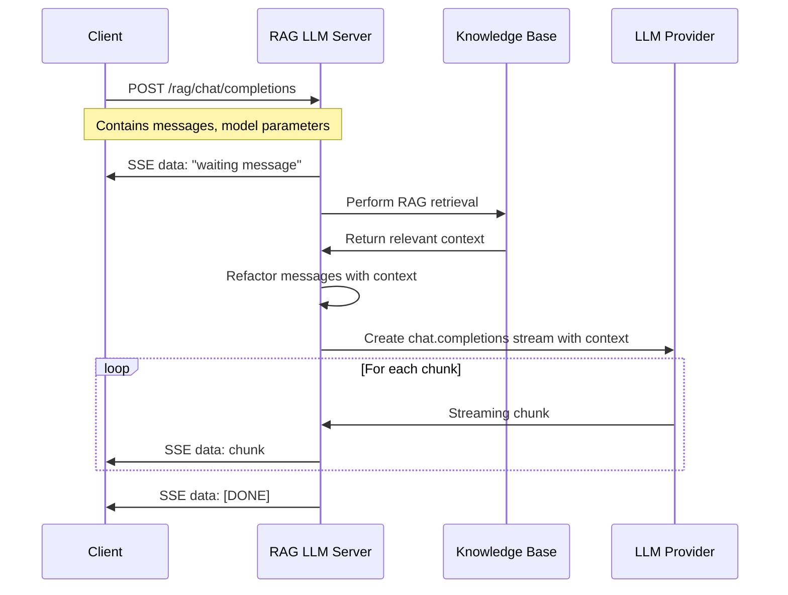

# 🌟 RAG-Enhanced LLM Python Example Code

[中文](README-CN.md) | [English](README.md)

> Agora Conversational AI Engine supports Retrieval-Augmented Generation (RAG) functionality. This project provides Python example code for implementing RAG-enhanced custom large language model services.

## 📖 What is RAG?

Retrieval-Augmented Generation (RAG) is a technique that combines information retrieval and generative AI. It works through the following steps:

1. **Retrieval**: Retrieve information relevant to the user's query from the knowledge base
2. **Augmentation**: Add the retrieved information as context to the user's query
3. **Generation**: The LLM generates answers based on the augmented context

### Why Use RAG?

- ✅ **Improved Accuracy**: Generate answers based on real information from the knowledge base, reducing hallucinations
- ✅ **Knowledge Updates**: No need to retrain the model, just update the knowledge base to get the latest information
- ✅ **Domain Expertise**: Can customize knowledge bases for specific domains, providing professional answers
- ✅ **Traceability**: Can track the source of answers, improving credibility

## 📁 Project Structure

```text
server-rag/
├── rag_llm.py              # RAG service main file, implements /rag/chat/completions endpoint
├── knowledge_base.py        # Knowledge base management module, provides search and management functionality
├── knowledge_base.json      # Knowledge base data file (JSON format)
├── requirements.txt        # Python dependencies
├── README.md               # Project documentation
└── .gitignore             # Git ignore file
```

## 🚀 Quick Start

### Method 1: Local Deployment (Development & Testing)

#### Environment Setup

- Python 3.10+

Create virtual environment:

```bash
python3 -m venv venv
source venv/bin/activate
```

#### Configure LLM API Endpoint (Optional)

If you need to use a non-OpenAI LLM service, you can modify the `LLM_BASE_URL` constant in the `rag_llm.py` file:

```python
# In rag_llm.py file (around line 26)
LLM_BASE_URL = "https://api.openai.com/v1"  # Change to your LLM provider endpoint
```

**Important Notes**:
- `LLM_BASE_URL` is the API endpoint of the backend LLM provider (such as OpenAI, DeepSeek, etc.), not the RAG service endpoint itself
- The server requires an LLM service compatible with OpenAI Chat Completions API format
- API Key must be provided via the `Authorization` header in requests (format: `Bearer <your-api-key>`)
- Default uses OpenAI API endpoint, if you need to use other services, please modify the `LLM_BASE_URL` constant in the code

#### Configure Knowledge Base

Edit the `knowledge_base.json` file to add your knowledge base content:

```json
{
  "category1": [
    "Your knowledge base content 1",
    "Your knowledge base content 2"
  ],
  "category2": [
    "More content..."
  ],
  "default": [
    "This is a default knowledge base entry, used when no other category matches."
  ]
}
```

**Knowledge Base Format**:
- Use JSON format, each category is an array containing multiple document strings
- Category names can be any string (such as "agora", "ai", "rag", etc.)
- The `default` category is special and will be used when no other category matches
- Supports mixed Chinese and English content

**Search Features**:
- ✅ Supports mixed Chinese and English queries and matching
- ✅ English words use exact matching (word boundaries) to avoid misidentification
- ✅ Chinese uses keyword matching
- ✅ Automatically removes punctuation to improve matching accuracy
- ✅ Sorted by match score, returns the most relevant documents

**Advanced**: Can be replaced with vector databases (such as Chroma, Pinecone, Weaviate) or use embedding models for semantic search.

#### Install Dependencies

```bash
pip install -r requirements.txt
```

#### Run Example Code

```bash
python3 rag_llm.py
```

After the server runs, you will see the following output:

```bash
INFO:     Uvicorn running on http://0.0.0.0:8000 (Press CTRL+C to quit)
```

Test the server with the following command:

```bash
curl -X POST http://localhost:8000/rag/chat/completions \
  -H "Content-Type: application/json" \
  -H "Authorization: Bearer your-api-key-here" \
  -d '{"messages": [{"role": "user", "content": "What is Agora?"}], "stream": true, "model": "your-model-name"}'
```

**Note**: Replace `your-api-key-here` and `your-model-name` with your actual LLM API Key and model name.

#### Verify Knowledge Base is Triggered

After starting the service, the logs will show detailed RAG retrieval information:

```text
🔍 RAG Retrieval: Searching knowledge base for query: 'What is Agora?'
📚 RAG Retrieval: Found 3 relevant chunks
🎯 Knowledge Base Match: category='agora', score=2, doc_preview='Agora provides real-time communication solutions...'
✅ RAG Context Retrieved: 245 characters
📝 RAG Messages Refactored: Added context to 2 messages
```

### Method 2: GitHub Codespaces Deployment (Testing AI Studio Custom LLM)

#### 1. Create GitHub Codespaces

1. Open your code repository on GitHub
2. Click the **Code** button, select the **Codespaces** tab
3. Click **Create codespace on main** to create a new Codespace
4. Wait for the Codespace to start

#### 2. Configure Port Forwarding

1. In the Codespaces terminal, navigate to the project directory:
   ```bash
   cd server-rag
   ```

2. Create virtual environment and install dependencies:
   ```bash
   python3 -m venv venv
   source venv/bin/activate
   pip install -r requirements.txt
   ```

3. Start the service:
   ```bash
   python3 rag_llm.py
   ```

4. **Configure Port Forwarding**:
   - Codespaces will automatically detect port 8000
   - In VS Code's **Ports** tab, find port 8000
   - Right-click the port, select **Port Visibility** → **Public**
   - Copy the generated public URL (format similar to: `https://xxxxx-8000.app.github.dev`)

#### 3. Create Project in AI Studio and Configure Custom LLM

1. Log in to [Agora Console](https://console.shengwang.cn/)
2. Go to **AI Studio** → **Projects** (or directly visit [Projects page](https://console-conversationai.shengwang.cn/product/ConversationAI/studio/projects))
3. Click **Create Project**
4. Fill in project information, enable "Custom Settings" to configure llm:

```json
{
  "llm": {
    "vendor": "custom",
    "params": {
      "model": "your-model-name"
    },
    "api_key": "your-api-key-here",
    "url": "https://xxxxx-8000.app.github.dev/rag/chat/completions"
  }
}
```

5. Save the project, **record the generated Pipeline ID** (needed when starting Agent later)

#### 4. Verify RAG LLM

You can use the `server-python-lite` script to verify that RAG LLM is working properly. For detailed steps, please refer to [server-python-lite/README.md](../server-python-lite/README.md).

## 🔄 RAG Workflow



## 📝 Core Features

### 1. RAG Retrieval (`perform_rag_retrieval`)

Current implementation uses an improved keyword matching algorithm:

- **Mixed Chinese-English Support**: Automatically identifies and extracts English words to avoid misidentification
- **Exact Matching**: English words use word boundary matching to ensure accuracy
- **Keyword Extraction**: Automatically removes punctuation and extracts valid keywords
- **Score Sorting**: Sorted by match score, returns the most relevant documents (default top_k=3)

**Extensibility**: You can replace with:

- **Vector Databases**: Use embedding models to convert documents and queries into vectors for similarity search
- **Semantic Search**: Use BERT, Sentence-BERT and other models for semantic matching
- **Hybrid Search**: Combine keyword search and semantic search

### 2. Message Refactoring (`refact_messages`)

Adds the retrieved context to the beginning of the message list as a system message, formatted as follows:

```
System message: "Use the following context to answer the user's question:

[Retrieved context]

If the context doesn't contain relevant information, use your general knowledge to answer."
```

This allows the LLM to prioritize information from the knowledge base while retaining the ability to use general knowledge.

### 3. Streaming Response

Supports Server-Sent Events (SSE) format streaming response:

- **Waiting Message**: During RAG retrieval, first send a waiting message to the client
- **Real-time Streaming**: After retrieval completes, stream the LLM-generated answers in real-time
- **Completion Marker**: Send `[DONE]` marker when streaming response ends

### 4. Error Handling

- **API Key Validation**: Automatically extracts API Key from `Authorization` header
- **Streaming Errors**: Captures and logs errors during streaming generation
- **Graceful Degradation**: If knowledge base retrieval fails, returns empty context, LLM can still answer normally

## 🔧 Custom RAG Implementation

### Managing Knowledge Base

The project provides the `knowledge_base.py` module to manage the knowledge base:

```python
from knowledge_base import get_knowledge_base

# Get knowledge base instance (automatically loads knowledge_base.json)
kb = get_knowledge_base()

# Add document (dynamically add at runtime)
kb.add_document("category", "Your document text here")

# Search documents
results = kb.search("your query", top_k=3)

# Get all documents
all_docs = kb.get_all_documents()
```

**KnowledgeBase Class Methods**:

- `load_from_file(file_path)`: Load knowledge base from JSON file
- `add_document(category, document)`: Add document to specified category
- `search(query, top_k=3)`: Search knowledge base, return most relevant documents
- `get_all_documents()`: Get all documents

### Using Vector Databases

Example: Using Chroma vector database

```python
import chromadb
from chromadb.config import Settings

# Initialize Chroma client
chroma_client = chromadb.Client(Settings())

async def perform_rag_retrieval(messages, knowledge_base=None):
    query = extract_query_from_messages(messages)
    
    # Query vector database
    collection = chroma_client.get_collection("knowledge_base")
    results = collection.query(
        query_texts=[query],
        n_results=3
    )
    
    # Return retrieved documents
    return "\n\n".join(results['documents'][0])
```

### Using Embedding Models

Example: Using OpenAI embedding model

```python
from openai import AsyncOpenAI

async def perform_rag_retrieval(messages, knowledge_base=None):
    query = extract_query_from_messages(messages)
    client = AsyncOpenAI(api_key=api_key)
    
    # Generate query embedding
    query_embedding = await client.embeddings.create(
        model="text-embedding-ada-002",
        input=query
    )
    
    # Search for similar documents in vector database
    # ... implement vector similarity search
    
    return retrieved_context
```

## 📚 Related Resources

- 📖 Check out our [Conversational AI Engine Documentation](https://doc.agora.io/doc/convoai/restful/landing-page) for more details
- 🧩 Visit [Agora SDK Examples](https://github.com/AgoraIO) for more tutorials and example code
- 👥 Explore high-quality repositories managed by the developer community at [Agora Developer Community](https://github.com/AgoraIO-Community)

## ❓ FAQ

### Q: Why does it only return documents from the default category?

A: Possible reasons:
1. No keywords matching other categories in the query
2. Knowledge base file not loaded correctly (check loading information in logs)
3. Keywords in query don't match knowledge base content

**Solutions**:
- Check server logs to confirm extracted keywords and match results
- Ensure knowledge base contains keywords related to the query
- Check if knowledge base JSON file format is correct

### Q: How to improve search accuracy?

A: Suggestions:
1. **Optimize Knowledge Base Content**: Use clear, specific keywords
2. **Category Management**: Organize related content into appropriate categories
3. **Extend Implementation**: Use vector databases and embedding models for semantic search

### Q: Which LLM providers are supported?

A: Supports all LLM providers compatible with OpenAI API format, including:
- OpenAI
- DeepSeek
- Other OpenAI-compatible APIs

Just modify `LLM_BASE_URL` and provide the corresponding API Key.

### Q: How to handle large knowledge bases?

A: Current implementation uses in-memory storage, suitable for small to medium knowledge bases. For large knowledge bases, it's recommended to:
1. Use vector databases (Chroma, Pinecone, etc.)
2. Implement pagination loading
3. Use caching mechanisms

### Q: How to debug RAG retrieval process?

A:
1. Set log level to `DEBUG`: `logging.basicConfig(level=logging.DEBUG)`
2. Check keyword extraction and matching information in logs
3. Check return value of `perform_rag_retrieval` function

## 💡 Feedback

- 🤖 If you have any questions or suggestions about the example project, please feel free to submit an issue.

## 📜 License

This project uses the MIT License.
