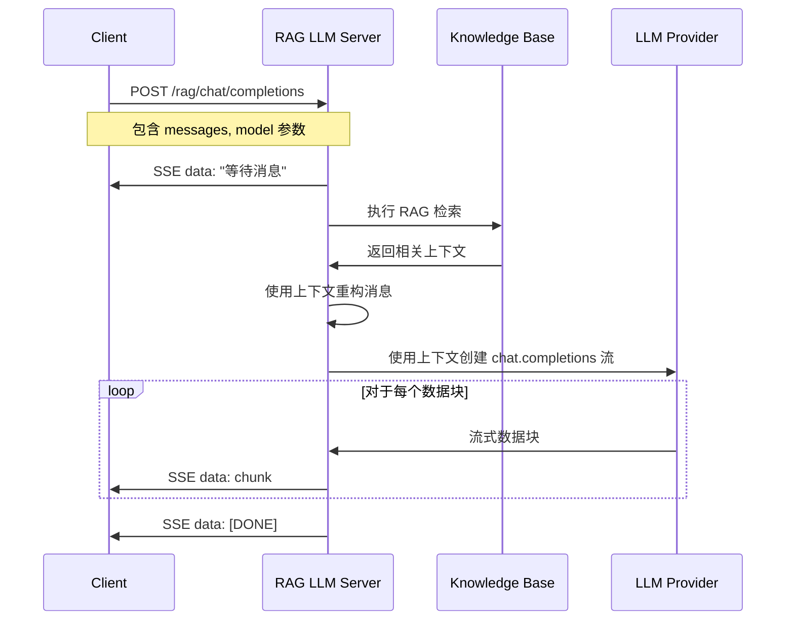

# 🌟 RAG 增强的 LLM Python 示例代码

> Agora 对话式 AI 引擎支持检索增强生成（RAG）功能。本项目提供了实现 RAG 增强的自定义大语言模型服务的 Python 示例代码。

## 📖 什么是 RAG？

检索增强生成（Retrieval-Augmented Generation，RAG）是一种结合信息检索和生成式 AI 的技术。它通过以下步骤工作：

1. **检索（Retrieval）**：从知识库中检索与用户查询相关的信息
2. **增强（Augmentation）**：将检索到的信息作为上下文添加到用户查询中
3. **生成（Generation）**：LLM 基于增强后的上下文生成回答

## 🚀 快速开始

### 环境准备

- Python 3.10+

创建虚拟环境：

```bash
python3 -m venv venv
source venv/bin/activate
```

### 配置 LLM API 端点

修改 `rag_llm.py` 文件中的 `LLM_BASE_URL` 常量：

```python
LLM_BASE_URL = "https://api.deepseek.com"  # 修改为您的 LLM 提供商端点
```

**重要提示**：
- `base_url` 不应包含 `/chat/completions` 路径，AsyncOpenAI 客户端会自动添加
- API Key 必须通过请求的 `Authorization` header 提供（格式：`Bearer <your-api-key>`）

### 配置知识库

编辑 `knowledge_base.json` 文件来添加您的知识库内容：

```json
{
  "category1": [
    "您的知识库内容 1",
    "您的知识库内容 2"
  ],
  "category2": [
    "更多内容..."
  ]
}
```

**进阶**：可以替换为向量数据库（如 Chroma、Pinecone、Weaviate）或使用嵌入模型进行语义搜索。

### 安装依赖

```bash
pip install -r requirements.txt
```

### 运行服务

```bash
python3 rag_llm.py
```

服务器运行后，您将看到：

```bash
INFO:     Uvicorn running on http://0.0.0.0:8000 (Press CTRL+C to quit)
```

### 测试服务

```bash
curl -X POST http://localhost:8000/rag/chat/completions \
  -H "Content-Type: application/json" \
  -H "Authorization: Bearer your-api-key-here" \
  -d '{"messages": [{"role": "user", "content": "什么是 Agora？"}], "stream": true, "model": "your-model-name"}'
```

### 验证知识库是否被触发

启动服务后，日志中会显示 RAG 检索的详细信息：

```
🔍 RAG Retrieval: Searching knowledge base for query: '什么是 Agora？'
📚 RAG Retrieval: Found 3 relevant chunks
🎯 Knowledge Base Match: category='agora', score=2, doc_preview='Agora 提供实时通信解决方案...'
✅ RAG Context Retrieved: 245 characters
📝 RAG Messages Refactored: Added context to 2 messages
```

## 🔄 RAG 工作流程



## 📝 核心功能

### 1. RAG 检索 (`perform_rag_retrieval`)

当前实现使用简单的关键词匹配。您可以替换为：

- **向量数据库**：使用嵌入模型将文档和查询转换为向量，进行相似度搜索
- **语义搜索**：使用 BERT、Sentence-BERT 等模型进行语义匹配
- **混合搜索**：结合关键词搜索和语义搜索

### 2. 消息重构 (`refact_messages`)

将检索到的上下文添加到消息列表的开头作为系统消息，让 LLM 能够使用这些上下文信息生成回答。

### 3. 流式响应

支持 Server-Sent Events (SSE) 格式的流式响应，提供实时交互体验。

## 🔧 自定义 RAG 实现

### 管理知识库

项目提供了 `knowledge_base.py` 模块来管理知识库：

```python
from knowledge_base import get_knowledge_base

# 获取知识库实例
kb = get_knowledge_base()

# 添加文档
kb.add_document("category", "Your document text here")

# 搜索文档
results = kb.search("your query", top_k=3)
```

### 使用向量数据库

示例：使用 Chroma 向量数据库

```python
import chromadb
from chromadb.config import Settings

# 初始化 Chroma 客户端
chroma_client = chromadb.Client(Settings())

async def perform_rag_retrieval(messages, knowledge_base=None):
    query = extract_query_from_messages(messages)
    
    # 查询向量数据库
    collection = chroma_client.get_collection("knowledge_base")
    results = collection.query(
        query_texts=[query],
        n_results=3
    )
    
    # 返回检索到的文档
    return "\n\n".join(results['documents'][0])
```

### 使用嵌入模型

示例：使用 OpenAI 嵌入模型

```python
from openai import AsyncOpenAI

async def perform_rag_retrieval(messages, knowledge_base=None):
    query = extract_query_from_messages(messages)
    client = AsyncOpenAI(api_key=api_key)
    
    # 生成查询嵌入
    query_embedding = await client.embeddings.create(
        model="text-embedding-ada-002",
        input=query
    )
    
    # 在向量数据库中搜索相似文档
    # ... 实现向量相似度搜索
    
    return retrieved_context
```

## 📚 相关资源

- 📖 查看我们的 [对话式 AI 引擎文档](https://doc.agora.io/doc/convoai/restful/landing-page) 了解更多详情
- 🧩 访问 [Agora SDK 示例](https://github.com/AgoraIO) 获取更多教程和示例代码
- 👥 在 [Agora 开发者社区](https://github.com/AgoraIO-Community) 探索由开发者社区管理的高质量仓库

## 💡 反馈

- 🤖 如果您对示例项目有任何问题或建议，欢迎提交 issue。

## 📜 许可证

本项目采用 MIT 许可证。

